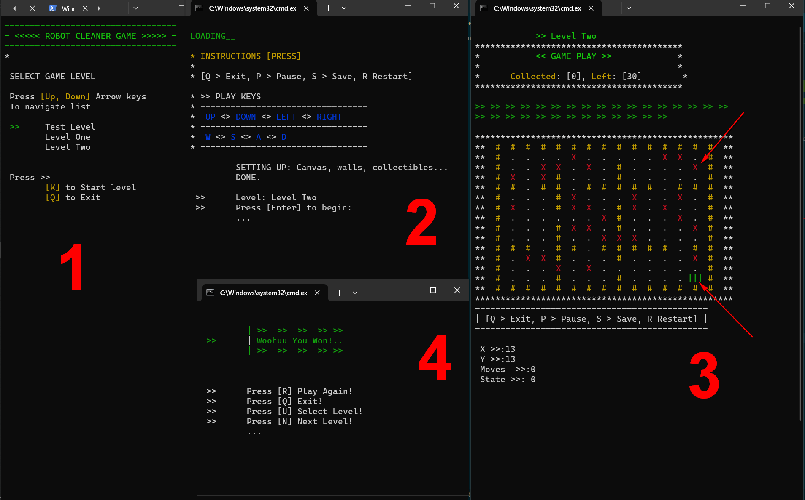

# Robot Cleaner

A robot cleaner Console game in cpp

## Game Play - Screenshot



## Features

- Content Menu
- Level Select
- Next, Save, Replay and Exit

# Levels

- Demo Level
- Level One
- Level Two

---

## Structure

- dec.h contains header files and class to method definitions
- def.cpp contains all class member properties and method implementation
- master.cpp contains game levels and a master class for adding game levels
- game.cpp where the game is initialized

---

```
  *****************
    Robot Cleaner
  *****************


   #  #  #  #  #  #  #  #  #  #
   #  -  -  -  -  -  -  -  -  #
   #  -  -  -  -  -  -  -  -  #
   #  -  -  -  -  @  -  -  -  #
   #  -  -  -  -  -  -  -  -  #
   #  #  #  #  #  -  -  -  -  #
   #  -  -  -  -  -  -  -  -  #
   #  -  -  -  -  -  -  -  -  #
   #  -  -  -  -  X  -  -  -  #
   #  #  #  #  #  #  #  #  #  #
```

---

## Requirements

To compile and run this game you will need _MinGW_ installed and configured for your system

Navigate to the root folder on the console and run

```c
g++ game.cpp def.cpp master.cpp -o game
```

This will create an game.exe file. Run it and play your game

---
